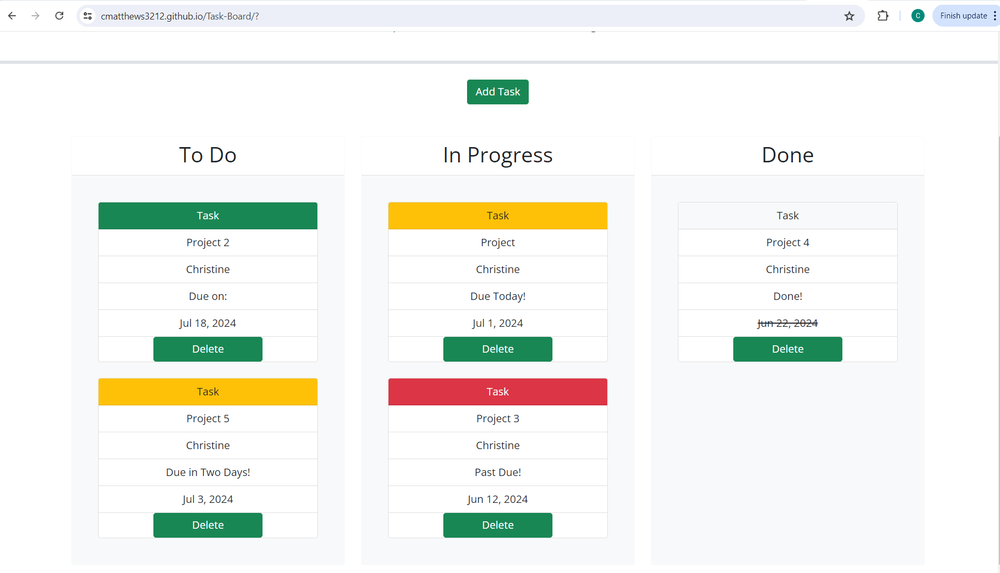

# Task Board Starter Code
App to showcase skills in bootstrap, jquery, and making cards draggable and droppable. 

## Description
This app is a Kanban board used for task management. Each task submitted by the form is stored in local storage, then the data that is stored is used to display each task in card format. 

## Installation
N/A

## Usage
To use this app, click the "add task" button to be directed to a form modal. Fill out the form related to your task and click submit. If you do not fill out the form and click submit, an alert informing you to fill out the form will appear. To escape the form modal, click outside the modal. 

The task header color will display depending on the due date of your task. If your task is due 4 or more days before the current date, the header color will be green and the task will state "Due on:" before the date. 

If your task is due within 3 days of the current date or due today, the header color will be yellow and the task will state either "due in three days," "due in two days," "do in one day," or "due today."

If the current day has surpassed the due date, the header color will be red and the task will state "past due." 

When you click a task in the to do column, you can drag it to the in progress and done columns. When a task is placed in the done column, the header color will be gray, the task will state "done," and the due date will be crossed out. 

If you click on the delete button on any task, that task will be removed from the Kanban board. 

## Screenshots

## Website
<a href="https://cmatthews3212.github.io/Task-Board/">Task Board Website</a>

## Credits
- https://getbootstrap.com/docs/4.0/components/modal/#via-javascript helped me get the Javascript for the form modal on line 10. This was added in commit "Add margin to submit button and removed close btn"
- Virtual assistant helped me create the generate task Id function on line 26. This was added in commit "Add uniqe id function and form"
- Virtual assistant helped me create the find index function for the delete button on line 161. This was added in commit "Make delete buttons work"
- The functions starting on lines 217, 239, 331, and 372 were all helped by the end of the week's mini project. These were added on commits "make pointer cursor on tasks," "make tasks draggable and droppable," and "create task cards."

## Bugs
Please note, there is currently a bug, where randomly there will be a form submission that may add multiples of the same task. You can delete each individual task if this happens. 

## License
Please refer to the LICENSE in the repo.

## Badges
N/A

## Features
N/A